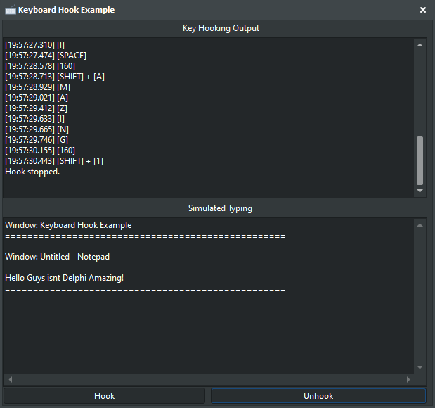

# 🎯 Delphi Low Level Keyboard Hook

This Delphi VCL application provides a sophisticated keyboard monitoring system with dual output modes: technical logging and real-time typing simulation. The application maintains full window context awareness and handles all keyboard events with precise timing and detailed event information. (And yes, it properly cleans up after itself by removing the hook when closed, so no worries about lingering keyboard hooks!)

<!-- Replace 'Preview.png' with the path to your actual image file -->

  

## 🛠️ Features

- 🎮 **Dual Output Modes:** 
  - Technical logging with timestamps and key combinations
  - Real-time typing simulation with window tracking
- 🖥️ **Window Context Awareness:** Automatically tracks and displays active window titles
- ⌨️ **Complete Key Coverage:** Handles all keyboard events including modifiers (Ctrl, Alt, Shift, Win)
- 🕒 **Precise Timing:** Millisecond-accurate event timestamps
- 📱 **Clean GUI:** Easy-to-use interface with dual display panels

## 🔧 Installation

1. 📥 **Download & Extract:** Download the project files and extract them to your local machine
2. 🖥️ **Open Delphi Project:** Open the `.dpr` file in the Delphi IDE
3. ⚙️ **Compile:** Build the project to generate the executable
4. 🚀 **Run:** Execute the application to start monitoring

## ⚙️ Usage

1. 🎯 **Start Hook:** Click the "Start Hook" button to begin keyboard monitoring
2. 📊 **View Output:**
   - TOP panel shows technical logs with timestamps
   - BOTTOM panel displays real-time typing simulation
3. 🛑 **Stop Hook:** Click "Stop Hook" to end monitoring
4. 📋 **Window Context:** Active window titles are automatically tracked and displayed

**Note:** Ensure you have appropriate authorization before using this tool in any environment. (Stay Legal Guys!)

## 🔒 Technical Implementation

- 💻 Uses Windows Low Level Keyboard Hook (WH_KEYBOARD_LL)
- 🔑 Full virtual key code mapping system
- 📝 Comprehensive character mapping for special keys
- 🛡️ Thread-safe event processing
- 🧹 Automatic hook cleanup on application close

## 🤝 Contributing

Contributions are welcome! If you have suggestions or bug fixes, please fork the repository and submit a pull request.

## 📜 License

This project is provided "as is" without warranty. Use it at your own risk.

## 📧 Contact

Discord: bitmasterxor

Made with ❤️ by: BitmasterXor, using Delphi RAD Studio

