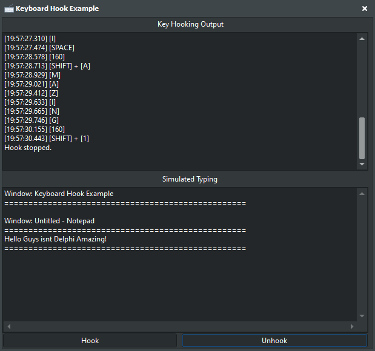

# Delphi Low Level Keyboard Hook

Delphi project showcasing low-level keyboard capture on Windows in two complete forms:

1. Standalone VCL source application and demo UI.
2. Reusable VCL drag-and-drop component (`TKeyboardHook`) with its own demo project.

Both implementations use `WH_KEYBOARD_LL`, include window-context tracking, and clean up hooks correctly on shutdown.

  

## What Is Included

1. Original source app (manual hook control)
Path: `keyboardhook.dpr`, `Unit1.pas`, `Unit1.dfm`
2. Original app demo assets
Path: `preview.png`, `Images and Media/`
3. New installable VCL component package
Path: `KeyboardHookComponent/KeyboardHookComponent.dpk`
4. Component source unit
Path: `KeyboardHookComponent/uKeyboardHook.pas`
5. Component palette icon resource
Path: `KeyboardHookComponent/uKeyboardHook.dcr`
6. Dedicated component demo project
Path: `KeyboardHookComponent/Demo/KBHookDemo.dpr`

## Features

1. Dual output modes for technical logging and typing simulation.
2. Active window title tracking with context-aware events.
3. Full key coverage including Ctrl, Alt, Shift, and Win keys.
4. Millisecond-level event timing metadata.
5. Event-driven component API for rapid form integration.
6. Safe shutdown behavior that removes hooks reliably.

## Quick Start

### Option A: Run the original standalone app

1. Open `keyboardhook.dpr` in Delphi.
2. Build and run.
3. Use Start Hook and Stop Hook in the UI.

### Option B: Install and use the VCL component

1. Open `KeyboardHookComponent/KeyboardHookComponent.dproj` (or `.dpk`) in Delphi.
2. Build the package.
3. Install the package from the IDE package manager.
4. Find `TKeyboardHook` on the `BitmasterXor` component palette tab.
5. Drop it onto a form and set `Active := True` or call `StartHook`.

### Option C: Run the component demo

1. Open `KeyboardHookComponent/Demo/KBHookDemo.dpr`.
2. Build and run.
3. Interact with the demo form to test `TKeyboardHook` events.

## Component API (TKeyboardHook)

Published properties:

1. `Active`
2. `TrackWindowChanges`

Published events:

1. `OnKeyDown`
2. `OnKeyUp`
3. `OnWindowChange`

Public methods:

1. `StartHook`
2. `StopHook`

## Technical Notes

1. Uses Windows `WH_KEYBOARD_LL` hook infrastructure.
2. Designed for one active component hook instance per process.
3. Intended for authorized testing, tooling, and accessibility scenarios.
4. Keep event handlers lightweight to avoid hook timeout removal by Windows.

## Contributing

Pull requests are welcome for bug fixes, performance improvements, and additional demo scenarios.

## License

Provided as-is without warranty. Use at your own risk.

## Contact

Discord: `bitmasterxor`

Built by BitmasterXor with Delphi RAD Studio

